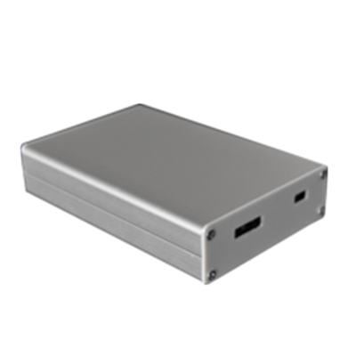
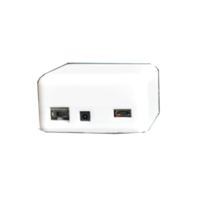
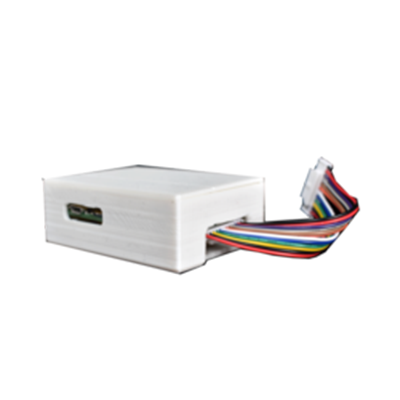
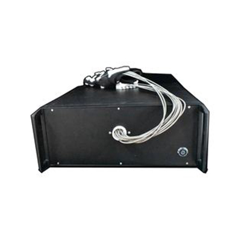
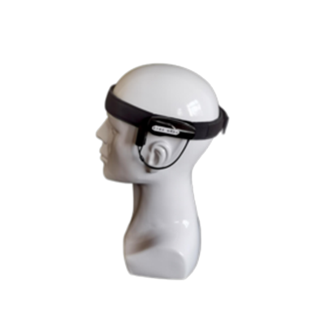
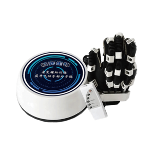
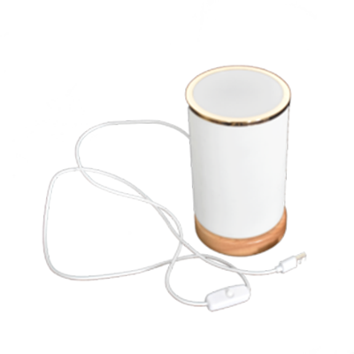

### BCIduino是什么？

`BCIduino`是一款由航弈生物开发的低成本的面向入门爱好者的脑电设备，它可以实时无线采集8通道高精度24位脑电数据，兼容Matlab/python/安卓/树莓派/香橙派/ubuntu/mac等设备或系统，可以满足基本的爱好者级别的脑电数据采集实验操作。

### 主要产品

主要产品为脑机接口硬件设施，涉及领域科研、康复、教育设备。

#### BCI Pro科研级脑电采集设备

主要用于脑电电生理信号采集，将采集到的电生理信号放大并转换成数字信号，通过 USB 接口传输到电脑中，以供后续的数据处理以及实验。

#### BCIduino工业级脑电放大器

BCIduino脑肌电模块主要用于脑电、肌电等电生理信号采集，将采集到的电生理信号放大并转换成数字信号，通过 USB 接口（或蓝牙）传输到电脑中，以供后续的数据处理以及实验。

> 产品视频

[航弈生物脑电放大器](https://www.bilibili.com/video/BV1wJ411U7qQ)

#### EMGduino肌电采集模组

EMGduino 肌电采集模组最高 1kHz 采集肌电数据，通过有线串口传输数据至计算机，提供了 Windows 波形显示、滤波与数据流转发客户端，可以根据实际项目需求对产品进行自定义修改和封装。

> 产品视频

[EMGduino肌电采集模组](https://www.bilibili.com/video/BV1854y1S7iU)

#### EXOduino II型柔性可编程手外骨骼

EXOduino II型可编程手外骨骼是一款面向康复、脑机接口领域科研用户的产品。提供了较为全面和开放的开发接口，可以根据自己项目的要求进行手套外骨骼控制指令修改，实现单指运动、多指运动、全手掌运动、对指运动等。

#### EDUduino可穿戴脑机设备

EDUduino可穿戴脑机设备是一款面向脑科学教育、专注度训练与康复训练的便携式脑电头戴设备。并提供了专注度训练 Android APP，可以通过 APP 解析脑电信号，进而控制机器人、玩具、康复外骨骼科研设备等。

#### EXOduino I型手部气动康复仪

康复训练仪是通过空气压力自动驱使手指及手腕部活动，以降低痉挛，帮助恢复手指功能。而且还可以作用于脑部神经及血管，促进脑部损伤的保守治疗和手术后康复。

> 产品视频

[EXOduino I型手部蓝牙气动康复训练仪](https://www.bilibili.com/video/BV1W44y187GT)

#### 脑控彩灯

脑控彩灯是运用脑电波技术开发出的一款趣味玩具，佩戴我们的脑机设备并连接彩灯，头上的脑电设备会检测并分析脑电波，并且灯的颜色会随着情绪的起伏和思维状态的变化而变化。

> 产品视频

[BCIduino脑机脑控彩灯](https://www.bilibili.com/video/BV1744y1C7dC)

### 视频教程

#### BCIduino资料整理PDF解读

[BCIduino资料整理PDF解读-1](https://www.bilibili.com/video/BV1Wp4y1r7qN)

[BCIduino资料整理PDF解读-2](https://www.bilibili.com/video/BV1sZ4y1G7Ua)

[BCIduino资料整理PDF解读-3](https://www.bilibili.com/video/BV15a4y1W7a3)

[BCIduino资料整理PDF解读-4](https://www.bilibili.com/video/BV1Jy4y1q7GD)

[BCIduino资料整理PDF解读-5-有线版BCIduino驱动安装](https://www.bilibili.com/video/BV1aZ4y1G7CU)

[BCIduino资料整理PDF解读-6-GUI保存的数据在哪里？什么格式？](https://www.bilibili.com/video/BV1ot4y1a7vj)

[BCIduino资料整理PDF解读-7-BCIduino传输数据至Matlab](https://www.bilibili.com/video/BV1Xz4y1k7bt)

[BCIduino资料整理PDF解读-8-EXOduino外骨骼通信协议](https://www.bilibili.com/video/BV1Uv411t7oT)

[BCIduino资料整理PDF解读-9-BCIduino通道定义图](https://www.bilibili.com/video/BV1gy4y1q7Qn)

[BCIduino资料整理PDF解读-10-BCIduino ERP](https://www.bilibili.com/video/BV18a4y1W7H5)

[BCIduino资料整理PDF解读-11-BCIduino P300](https://www.bilibili.com/video/BV1vz4y1k7kH)

[BCIduino资料整理PDF解读-12-BCIduino SSVEP](https://www.bilibili.com/video/BV1oT4y1T7rM)

[BCIduino资料整理PDF解读-13](https://www.bilibili.com/video/BV1UD4y1X7xx)

[BCIduino资料整理PDF解读-14-OpenBCI脑电帽安装](https://www.bilibili.com/video/BV18y4y167ZM)

### 应用视频

### 由你补充

> 以上资料源自互联网，如有不同看法或补充可自行编辑提交修改

