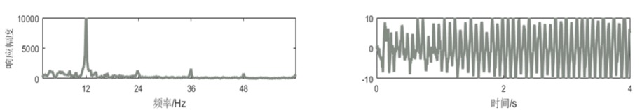
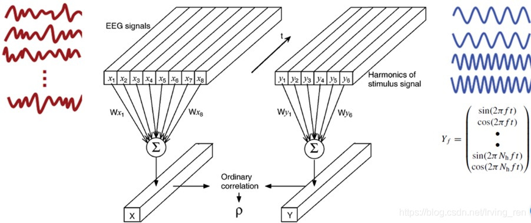
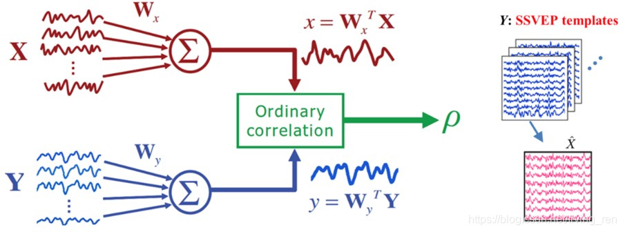
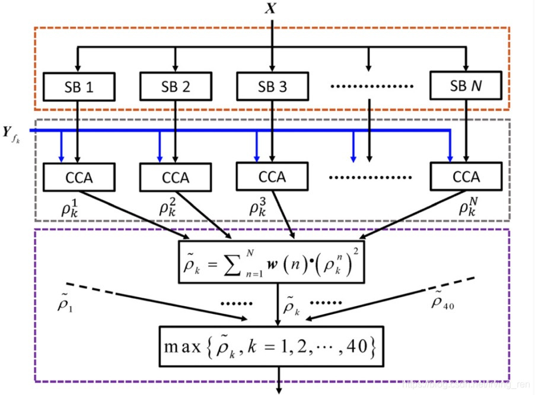

### 脑机接口是什么？

脑机接口是一种技术，通过电极构建人脑和外界交互的窗口，实现一方面采集大脑神经信息读取大脑意识从而用于控制外部设备，另一方面可以把外界信息通过刺激反馈给大脑。脑机接口（英语：`brain-computer interface`，简称`BCI`；有时也称作`direct neural interface`或者`brain-machine interface`），是在 `人`或`动物`大脑（或者脑细胞的培养物）与外部设备间建立的直接连接通路。

### 脑机接口的原理

神经活动则是大脑产生思维的基础，而且每一种活动模式都对应着一种特定的思维形态。BCI系统就是通过辨别神经活动的模式，对思维进行解码，并通过控制系统实现与外界环境的交流。
中枢神经系统活动包括发生在中枢神经系统中的电生理活动、神经化学反应和新陈代谢现象，如动作电位、突触后电位、神经递质释放、氧代谢活动等等。通过放置在头皮上、大脑皮层表面或者大脑内的传感器，我们可以检测到与神经活动相关的电磁场、氧合血红蛋白或者其他生理参数的变化。这些参数能够从一个特定的方面反映大脑内部的活动情况。BCI系统通过记录这些大脑活动信号，从中提取出具有明确意义的特征，并将这些特征转换为可以作用于外界或人体本身的输出量。BCI系统的基本结构包括信号采集系统、信号处理与转换系统以及执行单元。

> 参考文献

[极简脑机接口原理](https://zhuanlan.zhihu.com/p/127091936)

### 脑机接口范式

#### Steady-state visual evoked potentials(SSVEP)

基于稳态视觉诱发电位的BCI系统是目前最常用的头皮脑电BCI系统之一，以SSVEP作为目标信号。SSVEP是一种通过向subject呈现以一定频率快速闪烁的刺激块，然后在头皮上记录到与刺激频率倍频相同的稳态脑电响应。



如上图所示，给subject呈现了以12Hz闪烁的刺激块时 其EEG在频域与时域的波形显示。Frequently，可清楚observe 明显的peak在12,24,36,48Hz, 及就是1,2,3,4倍频处。Temporarily，可observe the steady period response。
SSVEP 原理：检测EEG signal中是否存在某些特定的频率成分。
典型算法: 由于SSVEP具体显著的频率特征, 基于频率的特征提取方法被大量采用，如: Power spectral density(PSD)

##### A. Canonical Correlation Analysis(CCA)



```
CCA是一种度量两组信号之间线性相关性的多元统计方法。由于此方法采用参考信号为正余弦信号，并没有加入EEG signal自身的high temporal resolution特性。在此不过多讲解此方法。
```

##### B. template-based CCA



```
此方法思想与CCA基本一致，不同之处是template-based 是将之前记录的刺激频率的EEG data的时间上的叠平均信号作为模板来估计空域滤波器。相比CCA，此方法可以更好的反应subject的EEG特异性。
```

##### C. Filter-bank CCA

为了有效的利用SSVEP的基频和谐波信息，从而提高识别精度。Filter-bank CCA was introduced.



此方法首先进行滤波器组分析，及就是将EEG signal滤波到不同的频率子带；然后对每个子带的数据做CCA得到CCA系数；最后将各个频率带的CCA系数加权求和，取和不同参考信号得到的加权和最大值对应的频率为识别目标。

##### D. Task-related Component Analysis(TRCA)

```
主要思想为寻找一个线性组合，使得原始数据中与事件相关的频率成分在多次试验的可重复性最大。具体可参考论文：Nakanishi, M., Wang, Y., Chen, X., Wang, Y., Gao, X., & Jung, T. (2018). Enhancing Detection of SSVEPs for a High-Speed Brain Speller Using Task-Related Component Analysis. IEEE Transactions on Biomedical Engineering, 65(1), 104-112.
```

> 参考文献

[目前几种常用的脑机接口范式](https://blog.csdn.net/Irving_ren/article/details/100065189)

#### P300

基于P300的BCI系统是以event-related potential(ERP)中的P300作为目标信号。P300电位是与大脑决策过程相关的ERP成分，反映着大脑对外界刺激的评价与分类过程。实验中 通常用oddball范式诱发P300电位。从EEG signal的时域图来看，是指大脑接受目标刺激大概250-500ms内呈现的正向偏移电位。

> 参考文献

[Visual evoked responses during standing and walking](https://www.ncbi.nlm.nih.gov/pmc/articles/PMC3024562/pdf/fnhum-04-00202.pdf)

#### Motor Imagery BCI(MI-BCI)

基于运动想象的BCI是通过检测用户MI产生的EEG来判断用户意图，进而实现人脑与外部设备之间的直接通信与控制。Subject在MI过程中，大脑皮层会产生两种变化明显的节律信号，8-15Hz的Mu与18-24Hz的Beta。同时，大脑皮层对侧运动感觉区的脑电节律能量会明显降低，而同侧运动感觉区的脑电节律能量增大，这种现象为事件相关异步(Event Related Desynchronization, ERD) 和 事件相关同步(Event Related synchronization, ERS)。 且不同部位的躯体运动想象与该躯体对应的感觉皮层ERD/ERS相关，也就是说ERD/ERS现象存在空间分布特性。也就是因为运动想象EEG signal空间分布的特性，构成了解码运动想象思维信号的生理基础，加上之前提到的特征提取算法就可以较好识别subject的意图。

> 参考文献

[Comparative Analysis of Spectral Approaches to Feature Extraction for EEG-Based Motor Imagery Classification](https://www.researchgate.net/publication/23169123_Comparative_Analysis_of_Spectral_Approaches_to_Feature_Extraction_for_EEG-Based_Motor_Imagery_Classification)

### 脑机接口的种类

#### 非侵入式

通过附着在头皮上的穿戴设备（如脑电帽、近红外头盔或磁共振头线圈等）测量大脑的电活动或代谢活动，无需手术，安全无创。

#### 半侵入式

半侵入式BCI对大脑表层或大脑神经进行记录或刺激。

#### 侵入式

侵入式脑机接口的电极长期稳定放置，直接记录神经元电活动，信号衰减小，信噪比和空间分辨率高。但这属有创伤植入，技术难度大，存在继发感染可能性，一旦发生颅脑感染、电极故障或电极寿命结束，需将电极取出，会造成二次损伤。

> 参考文献

[脑机接口技术的分类及其国内外发展分析](http://www.leadingir.com/trend/view/5489.html)

### 由你补充

> 以上资料源自互联网，如有不同看法或补充可自行编辑提交修改

